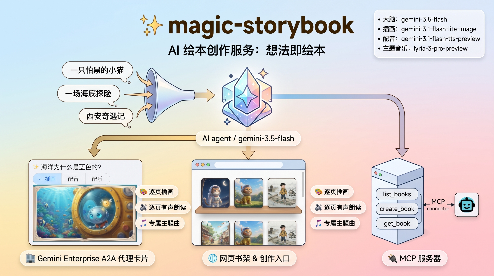

# ✨ magic-storybook



**magic-storybook** 是一个基于 Google ADK（Agent Development Kit）的 AI 绘本创作服务：
你只需说出一个想法——「一只怕黑的小猫」「一场海底探险」——它就会把它变成一本完整的绘本，
包含起承转合的故事、逐页精美插画、逐页有声朗读，以及一首与主题契合的专属主题曲，最后交付一个
可以翻页、听讲解、放音乐的沉浸式阅读器。书名、主题、画风、配乐都可以由你指定，也可以完全交给模型
根据创意自动构思。

它把「一个创意 → 一本可读可听的绘本」这条链路，用一个统一的 agent 封装起来，并在同一套代码上
同时对外提供三种入口：

- 🏢 **Gemini Enterprise**：通过 **A2A** 协议注册为「魔法绘本」agent，在 GE 内以富交互卡片
  （A2UI）直接呈现绘本——逐页 Tab（插画 / 讲解配音 / 文字）+ 全书主题曲 + 沉浸阅读链接；创作
  等待期间还会在 Thinking 栏实时显示进度。
- 🌐 **网页**：一个书架 / 创作 / 阅读 / 编辑的前端，外加首页对话助手；沉浸式阅读器翻页自动播放
  该页讲解、可开关主题曲。
- 🔌 **MCP**：以 Streamable-HTTP MCP server 暴露 `list_books` / `create_book` / `get_book`，
  供任意支持 MCP 的助手调用。

### 特性

- 🧠 **想法即绘本**：自动构思书名与主题，自动编排多页故事。
- 🎨 **逐页插画**（16:9），🔊 **逐页有声朗读**，🎵 **专属主题曲**，三者并行生成。
- 🖌️ **画风 / 配乐可选可自定义**，不指定时由大模型按主题自动匹配；页数默认 6。
- 🔒 **私有存储**：媒体存放于私有 GCS 桶，读时用 V4 签名 URL 现签现用，不落地公开链接。
- ☁️ **一体化部署**：单镜像同时提供 HTTP + A2A + MCP，一条 `deploy.sh` 完成 0→1。

## 使用方式

- **Gemini Enterprise**：对「魔法绘本」说出你的想法（书名/主题可由它自动构思），稍等 1-2 分钟即可在 GE 内看到富交互绘本卡片——逐页 Tab（插画 / 配音 / 文字）+ 主题曲，点底部链接进入沉浸式阅读器。也可以让它「列出绘本」再「打开某一本」。
- **网页**：打开首页浏览书架、点「创作新绘本」，或用右下角对话助手说出想法即可创建。阅读器翻页自动播放配音，可开关主题曲。
- **MCP**：支持 MCP 的助手可通过 `/mcp` 调用 `list_books` / `create_book` / `get_book`。

画面风格与主题曲风格可自定义，不指定时由大模型按主题自动选择；页数默认 6。

## 模型

| 能力 | 模型 |
| :-- | :-- |
| 故事 / agent | `gemini-3.5-flash` |
| 插画（16:9） | `gemini-3.1-flash-lite-image` |
| 有声朗读 | `gemini-3.1-flash-tts-preview` |
| 主题音乐 | `lyria-3-pro-preview` |

## 部署

在 Cloud Shell（owner 权限）从仓库根目录运行：

```bash
bash deploy.sh
```

会自动启用 API、创建私有 GCS bucket 与 Firestore、并部署两个 Cloud Run 服务：
`magic-storybook-frontend`（网页，IAP 保护）与 `magic-storybook-a2a`（Gemini Enterprise，IAM 认证）。

bucket / Cloud Run / Firestore 默认都创建在 **`us-central1`**，可用 `REGION` 覆盖。可选变量：
`REGION`、`GE_APP_ID`（设置后自动注册到 GE）：

```bash
REGION=asia-east1 GE_APP_ID="projects/<num>/locations/global/collections/default_collection/engines/<id>" bash deploy.sh
```
